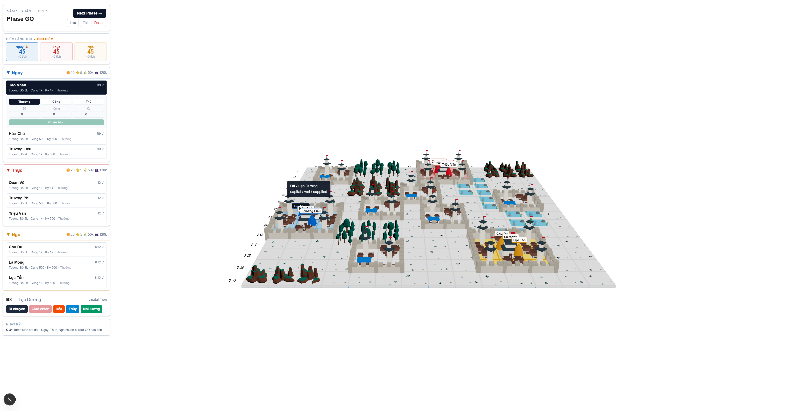

# Tam Quốc Tranh Hùng

Công cụ điều hành cho ván **Tam Quốc Tranh Hùng** — game chiến thuật 3 nước do một GM cầm trịch qua ~20 ngày thực, mỗi ngày 2 lượt (Go 9h–20h, Atc 20h–9h).

Luật chơi: **https://ferez96.com/hpln-game-demo/**



## Công cụ này làm gì

Người chơi PM lệnh cho GM. GM dán cả khối lệnh vào console, engine soát từng dòng theo luật, giải quyết lượt, rồi sinh chiến báo để đăng lại.

| Trang | Dùng để |
|---|---|
| `/gm` | Console GM: dán lệnh → soát ✓/✗ → giải quyết lượt → chiến báo → xuất bản |
| `/` | Bản đồ công khai, chỉ xem |

```bash
npm install
npm run dev     # mở http://localhost:3000/gm
```

Ván đấu lưu ở `data/game-save.json` (file này được git theo dõi, nên mỗi lượt là một commit — muốn lùi lượt thì `git revert`).

## Vòng làm việc một lượt

1. Mở `/gm`, dán lệnh người chơi vào ô soạn thảo. Mỗi dòng một người:

   ```
   player05: di C9; chieu 2000 bo
   Trương Liêu: cong; danh C3
   player01: nang mo; doi dan 5
   ```

2. Cột soát lệnh hiện ✓/✗ ngay khi gõ, kèm lý do bằng tiếng Việt. Phần kiểm tra chạy trên bản sao trạng thái bằng **đúng** hàm mà lượt thật sẽ chạy, nên kết quả xem trước không lệch với kết quả thật.
3. Bấm **Giải quyết lượt** — engine xử đồng thời cả ba nước, tự lưu ván.
4. Tab **Chiến báo**: copy markdown đi đăng, hoặc bấm **Xuất bản** để ghi thẳng vào `docs/tran-bao/`.
5. Tab **Bảng nước**: bảng tài nguyên riêng từng nước để PM cho Chủ Công (không đăng công khai).
6. `git commit && git push` → chiến báo lên GitHub Pages.

## Bảng lệnh

| Lệnh | Nghĩa |
|---|---|
| `di C9` | đi 1 ô theo cạnh vuông |
| `danh C9` | đánh ô kề hoặc ô đang đứng |
| `thu` / `cong` | đổi thế trận |
| `chieu 2000 bo` | tuyển Bộ Binh (phải đứng trên Ô Thành Trì) |
| `chieu 2000 cung` | quy đổi Bộ sang Cung; `ky` tương tự |
| `gui 1000 bo -> player11` | chuyển quân, cùng ô, chừa lại ≥1000 |
| `doi dan 3` | Nhà Dân: 3 Tài Nguyên → Dân |
| `doi lua 2000` | Ruộng: 2000 Dân → Lúa |
| `nang mo` | nâng cấp `mo`/`ruong`/`nhadan`/`bo`/`cung`/`ky` |

Nhiều lệnh trên một dòng thì cách nhau bằng `;`. Người chơi nhận diện bằng mã (`player05`) hoặc tên, có dấu hay không đều được. Dòng bắt đầu bằng `#` là ghi chú. Lệnh cấp quốc gia (`doi`, `nang`) chỉ Chủ Công hoặc Quân Sư ra được.

## Phạm vi luật đã cài

Engine hiện thực hóa **§1–9 của Luật Tối Giản** (bản đồ & địa hình, kinh tế, tuyển quân, di chuyển & chiếm đất, nối lương & chết đói, binh pháp, thời tiết 4 mùa, tính điểm, điều kiện thắng).

Chưa cài: Phù chú, Trận Pháp, thuyền & thủy chiến, lò rèn & cơ giới, Tinh Binh, Chiến Tướng, Hoa Đà/Tả Từ/Thủy Kính, Trảm Đầu/Trục Xuất/Phản Bội, Ẩn Thân/Đặt Bẫy/Trinh Sát.

Bàn cờ 13×13 (hàng A–M × cột 1–13) chép từ `reference/3kd-map.jpg`; id ô là **chữ hàng + số cột**, nên `B9` là hàng B cột 9 — đúng như người chơi đọc trên bản đồ in.

Danh sách người chơi tùy GM: luật gốc là 3 nước × 8 người, engine chỉ ràng buộc mỗi nước tối đa 1 Chủ Công và 1 Quân Sư (xem `game/setup.ts`).

## Cấu trúc

```
game/          engine thuần, không dính React — dùng chung cho console, trang công khai,
               script xuất bản và test
  rulebook.ts    mọi con số của luật, nguồn sự thật duy nhất
  board.ts       bàn cờ 13×13 chép từ bản đồ in
  setup.ts       danh sách người chơi → trạng thái ván mới
  economy.ts     thu nhập, quy đổi, nâng cấp, luật lương thực
  combat.ts      công thức chiến đấu §8
  supply.ts      nối lương
  orders/        cú pháp lệnh + soát lệnh
  resolve.ts     giải quyết lượt
  report.ts      chiến báo markdown
app/gm/        console GM
app/api/       ghi data/game-save.json và docs/tran-bao/ (chỉ chạy ở dev)
docs/          wiki luật (Docsify) + chiến báo đã xuất bản
```

## Lệnh

```bash
npm run dev            # console GM + bản đồ
npm test               # test engine (vitest)
npm run lint
npm run publish-board  # ghi lại riêng trang bản đồ vào docs/tran-bao/
```
